# Performance Analysis of Virtual Machines and Containers

## 📌 Abstract

This project experimentally analyzes the performance of **Virtual Machines (VMs)** and **Docker Containers** under different workloads.

The experiments cover CPU performance, memory performance, disk I/O, network performance, FastAPI application performance, startup time, and scalability.

The project uses benchmark tools such as **Sysbench, fio, iperf3, Apache Benchmark, wrk, Python, Pandas, and Matplotlib**.

The main purpose is to collect actual measurements, process the results using CSV files and Python, generate graphs, and analyze the observed behavior of virtual machines and containers.

---

## 🎯 Objectives

The main objectives of this project are:

1. To analyze CPU performance under the tested workload.
2. To analyze memory performance.
3. To analyze disk I/O performance.
4. To measure network throughput and retransmissions.
5. To analyze application performance using a FastAPI workload.
6. To measure container startup time.
7. To study scalability under increasing workloads.
8. To collect raw benchmark results.
9. To process benchmark results using CSV files and Python.
10. To generate graphs and statistical summaries.
11. To document the complete experiment for reproducibility.

---

## ❓ Research Questions

The project investigates the following questions:

1. How does CPU performance behave under increasing thread counts?
2. How does memory performance behave under the tested workload?
3. How does disk I/O performance behave under the tested workload?
4. What network throughput was achieved during the experiment?
5. How does the FastAPI application perform under load?
6. How long does the container take to start?
7. How does performance change as workload or concurrency increases?
8. What performance behavior is observed from the measured results?

---

## 🖥️ Experimental Environment

| Component | Configuration |
|---|---|
| Host OS | Windows |
| Hypervisor | VMware Workstation |
| Guest OS | Ubuntu |
| Container Platform | Docker |
| CPU Benchmark | Sysbench |
| Disk Benchmark | fio |
| Network Benchmark | iperf3 |
| Application | FastAPI |
| API Testing | Apache Benchmark, wrk |
| Analysis | Python, Pandas, Matplotlib |

---

## ⚙️ Hardware and Software Configuration

System information was recorded using:

```bash
lscpu
free -h
df -h
uname -a
```

The recorded configuration files are stored in:

```text
docs/cpu-info.txt
docs/memory-info.txt
docs/storage-info.txt
docs/kernel-info.txt
```

The project uses the following tools:

- Sysbench
- fio
- iperf3
- FastAPI
- Uvicorn
- Apache Benchmark
- wrk
- Pandas
- Matplotlib
- NumPy

---

## 🏗️ Architecture

The project compares two execution environments using benchmark workloads:

```text
                    PERFORMANCE ANALYSIS
                            │
              ┌─────────────┴─────────────┐
              │                           │
       VIRTUAL MACHINE               CONTAINER
              │                           │
           Ubuntu                       Docker
              │                           │
              └─────────────┬─────────────┘
                            │
                     TESTED WORKLOADS
                            │
        ┌───────────┬───────┼────────┬───────────┐
        │           │       │        │           │
       CPU       Memory    Disk    Network    FastAPI
        │           │       │        │           │
        └───────────┴───────┴────────┴───────────┘
                            │
                      FINAL ANALYSIS
```

---

## 🧪 Methodology

The experiments were performed using controlled benchmark workloads.

The general workflow was:

```text
Prepare Environment
        ↓
Configure VM
        ↓
Configure Docker
        ↓
Establish Baseline
        ↓
CPU Benchmark
        ↓
Memory Benchmark
        ↓
Disk Benchmark
        ↓
Network Benchmark
        ↓
FastAPI Benchmark
        ↓
Startup Test
        ↓
Scalability Test
        ↓
Collect Raw Data
        ↓
Python Analysis
        ↓
Graphs & Tables
        ↓
Final Discussion
        ↓
GitHub Repository
```

Raw benchmark outputs are stored separately from processed CSV data.

---

# 🔥 CPU Experiment

## Workload

CPU performance was measured using **Sysbench CPU** with the prime calculation workload.

The scalability experiment used:

- 1 thread
- 2 threads
- 4 threads
- 8 threads
- 30-second execution time

The workload used:

```text
cpu-max-prime = 20000
```

## CPU Results

| Environment | Threads | Events/sec | Avg Latency (ms) | P95 Latency (ms) |
|---|---:|---:|---:|---:|
| VM | 1 | 122.98 | 8.11 | 12.52 |
| VM | 2 | 218.57 | 9.14 | 15.27 |
| VM | 4 | 257.60 | 15.51 | 37.56 |
| VM | 8 | 284.29 | 28.07 | 58.92 |

### CPU Performance Graph

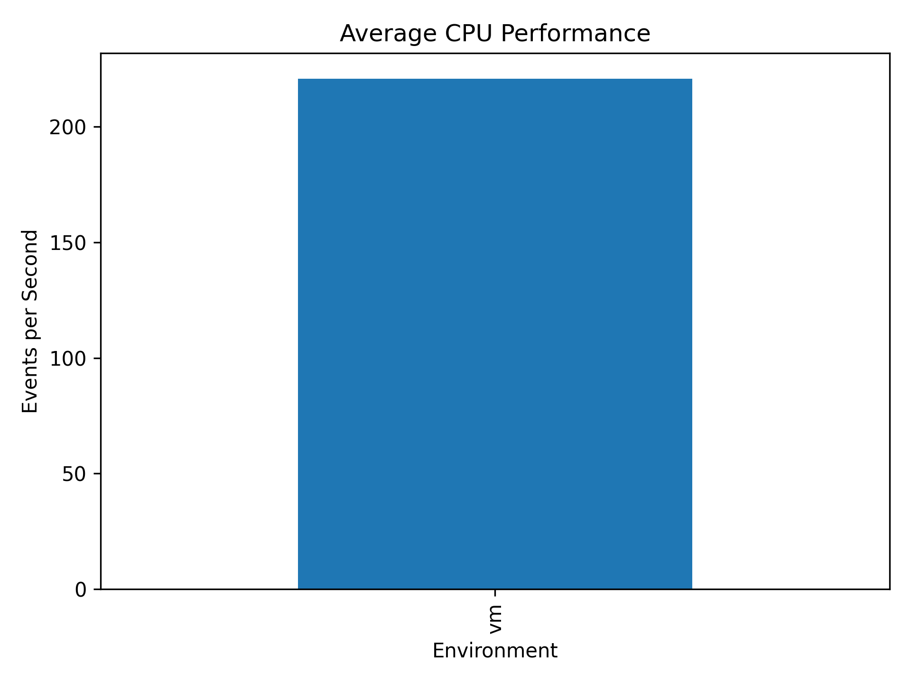

---

# 🧠 Memory Experiment

Memory performance was measured using **Sysbench Memory**.

The tested workload used:

- Block size: 1 MB
- Total memory size: 1 GB
- Threads: 1

## Memory Result

| Environment | Memory Size | Total Time (s) | Events | Avg Latency (ms) | P95 Latency (ms) |
|---|---:|---:|---:|---:|---:|
| Container | 1 GB | 0.6910 | 1024 | 0.63 | 2.00 |

### Memory Performance Graph

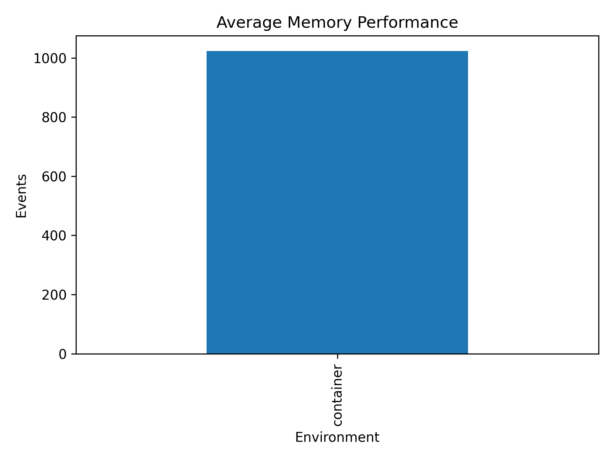

---

# 💾 Disk I/O Experiment

Disk performance was measured using **fio**.

The measured workload was sequential write.

## Configuration

- Block size: 1 MB
- Direct I/O: enabled
- Runtime: 30 seconds
- File size: 1 GB

## Disk Result

| Environment | Workload | Block Size | I/O Mode | Bandwidth (KiB/s) | IOPS |
|---|---|---|---|---:|---:|
| Container | Sequential Write | 1M | Write | 126915.14 | 123.52 |

CPU usage during the test:

- User CPU: 6.43%
- System CPU: 68.12%

### Disk Performance Graph

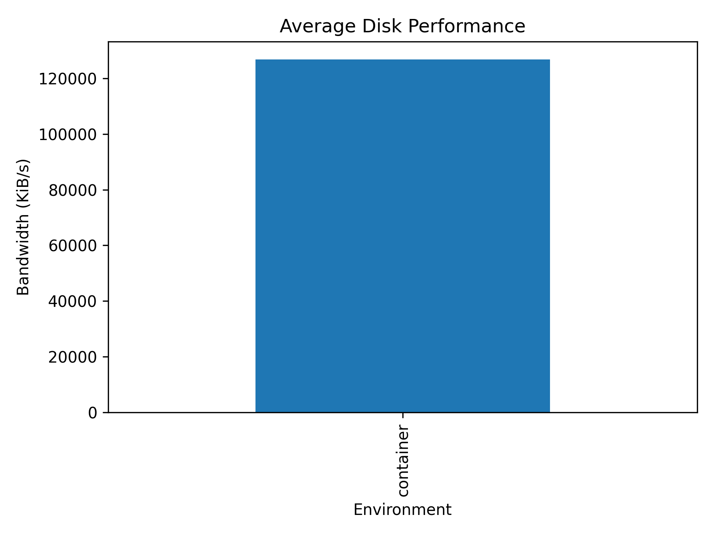

---

# 🌐 Network Experiment

Network performance was measured using **iperf3**.

The saved test used:

- Duration: 30 seconds
- Protocol: TCP
- Retransmissions: recorded from the test

## Network Result

| Environment | Test | Duration (s) | Throughput (Gbits/sec) | Retransmissions |
|---|---|---:|---:|---:|
| VM | iperf3 | 30 | 2.29 | 4 |

### Network Performance Graph

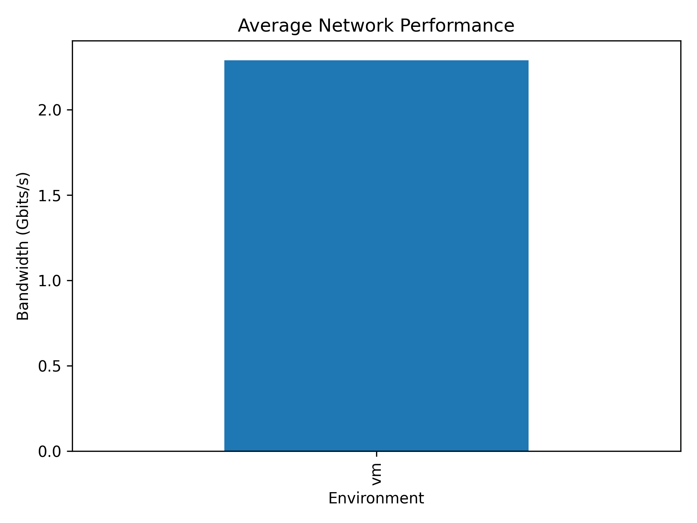

---

# 🚀 Application Experiment — FastAPI

A FastAPI application was developed to provide three endpoints:

```text
/health
/compute
/memory
```

The `/compute` endpoint performs a computational workload:

```python
total = 0

for i in range(1_000_000):
    total += i * i
```

The `/memory` endpoint creates a list containing one million elements.

The application was tested using Apache Benchmark.

## API Benchmark Result

The `/compute` endpoint was tested with:

```bash
ab -n 1000 -c 10 http://127.0.0.1:8000/compute
```

Result:

| Environment | Endpoint | Concurrency | Requests | Failed Requests | Time (s) | Requests/sec | Avg Time/request (ms) |
|---|---|---:|---:|---:|---:|---:|---:|
| VM | /compute | 10 | 1000 | 0 | 521.569 | 1.92 | 5215.690 |

### API Performance Graph


---

# ⏱️ Startup-Time Experiment

Container startup time was measured using repeated controlled Docker startup runs.

The command used was:

```bash
time docker run --rm -d --name startup-test -p 8000:8000 fastapi-benchmark
```

## Startup Results

| Environment | Run | Startup Time (s) |
|---|---:|---:|
| Container | 1 | 7.084 |
| Container | 2 | 3.164 |
| Container | 3 | 2.949 |

Average container startup time:

```text
4.399 seconds
```

### Container Startup Performance Graph

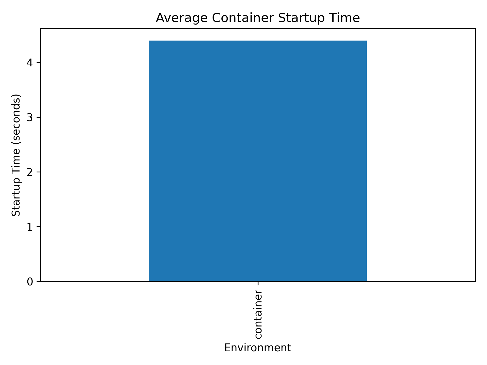

> VM startup and application-ready values were not recorded in the available measurements, so they are not fabricated here.

---

# 📈 Scalability Experiment

Scalability was tested by increasing CPU threads and API client connections.

## CPU Scalability

| Threads | Events/sec | Avg Latency (ms) | P95 Latency (ms) | Total Events |
|---:|---:|---:|---:|---:|
| 1 | 122.98 | 8.11 | 12.52 | 3690 |
| 2 | 218.57 | 9.14 | 15.27 | 6560 |
| 4 | 257.60 | 15.51 | 37.56 | 7728 |
| 8 | 284.29 | 28.07 | 58.92 | 8546 |

### CPU Scalability Graph

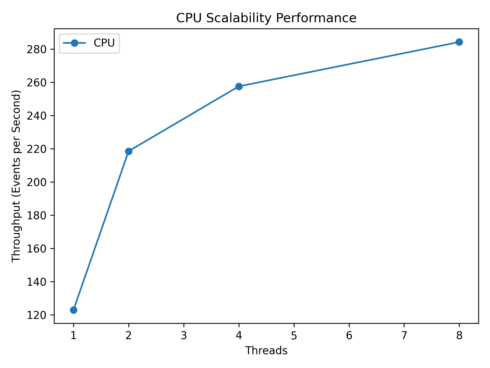

---

## API Scalability

The FastAPI workload was tested with increasing numbers of client connections.

| Threads | Connections | Requests/sec | Avg Latency (ms) | Total Requests |
|---:|---:|---:|---:|---:|
| 1 | 10 | 112.87 | 92.69 | 3392 |
| 2 | 50 | 150.28 | 331.02 | 4512 |
| 4 | 100 | 171.42 | 577.22 | 5153 |
| 4 | 200 | 147.64 | 1290.00 | 4439 |

The 200-connection test recorded a **maximum latency of approximately 2000 ms**. This value is not treated as a P95 value.

### API Scalability Graph

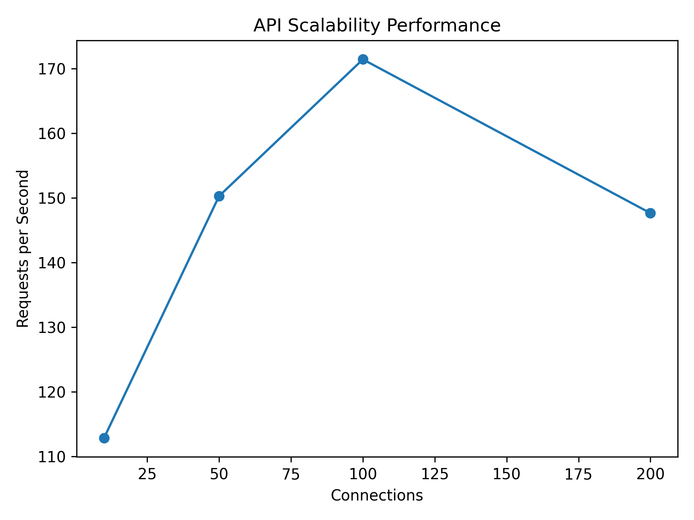

---

# 📊 Results Summary

The following table summarizes the measured results included in this project.

| Metric | Environment | Measured Result |
|---|---|---|
| CPU throughput | VM | 122.98–284.29 events/sec |
| Memory events | Container | 1024 events |
| Disk bandwidth | Container | 126915.14 KiB/s |
| Disk IOPS | Container | 123.52 |
| Network throughput | VM | 2.29 Gbits/sec |
| Network retransmissions | VM | 4 |
| API throughput | VM | 1.92 requests/sec |
| Container startup | Container | 2.949–7.084 sec |
| Average container startup | Container | 4.399 sec |

---

# 📐 Statistical Analysis

Statistical analysis was performed using Python and Pandas.

## CPU Statistics

| Statistic | Events/sec |
|---|---:|
| Mean | 220.86 |
| Median | 238.085 |
| Minimum | 122.98 |
| Maximum | 284.29 |
| Standard Deviation | 70.61 |

## Container Startup Statistics

| Statistic | Time (s) |
|---|---:|
| Mean | 4.399 |
| Median | 3.164 |
| Minimum | 2.949 |
| Maximum | 7.084 |
| Standard Deviation | 2.308 |

The statistical analysis uses the actual measured values collected during the experiment.

---

# ⚖️ VM vs Container Comparison

The experiment produced measurements for different workloads and environments.

However, the available measurements are **not complete matched VM-versus-container measurements for every experiment**. Therefore, unsupported comparisons are not fabricated.

The measured observations are:

- CPU scalability measurements were collected in the VM environment.
- Memory benchmark data was collected for the container environment.
- Disk benchmark data was collected for the container environment.
- Network benchmark data was collected in the VM environment.
- FastAPI `/compute` benchmark data was collected in the VM environment.
- Startup measurements were collected for the container environment.
- CPU and API scalability measurements were collected in the VM environment.

A complete VM-versus-container numerical comparison for every metric would require corresponding measurements from both environments using identical benchmark parameters.

---

# 💬 Discussion

The collected measurements show how the tested workloads behaved under the experimental conditions.

For CPU scalability, throughput increased from **122.98 events/sec at 1 thread** to **284.29 events/sec at 8 threads**. At the same time, average latency increased as the number of threads increased.

For API scalability, throughput increased from **112.87 requests/sec at 10 connections** to **171.42 requests/sec at 100 connections**. At 200 connections, throughput decreased to **147.64 requests/sec**, while average latency increased to **1290 ms**.

The CPU and API scalability results demonstrate that increasing workload does not necessarily produce a proportional increase in throughput.

The disk experiment recorded **126915.14 KiB/s** bandwidth and **123.52 IOPS** for the tested sequential-write workload.

The network experiment recorded **2.29 Gbits/sec** throughput with **4 retransmissions**.

The container startup measurements ranged from **2.949 seconds to 7.084 seconds**, with an average of **4.399 seconds**.

These observations are specific to the measured configuration and workloads used in this experiment.

---

# ⚠️ Limitations

The following limitations apply to the current experiment:

1. Not every benchmark has matched measurements from both VM and container environments.
2. Some experiments were performed with a single recorded measurement rather than multiple repetitions.
3. The measured environment may contain background system activity.
4. Network performance can depend on the selected network configuration.
5. Disk performance can depend on storage placement and configuration.
6. Startup measurements were collected for the container, while corresponding VM startup measurements were not recorded.
7. The available API scalability data does not contain P95 latency values for all tests.
8. The 2000 ms value recorded during the 200-connection API test represents maximum latency, not P95 latency.
9. Results should therefore be interpreted as measurements of the tested configuration rather than universal performance characteristics.

---

# ✅ Conclusion

This project implemented a performance analysis workflow for virtual machines and Docker containers using CPU, memory, disk, network, application, startup, and scalability workloads.

The project demonstrates the complete process of:

- Preparing the experimental environment
- Running controlled benchmarks
- Saving raw benchmark output
- Processing results using CSV files
- Performing statistical analysis
- Generating graphs
- Studying scalability
- Documenting the findings
- Publishing the project using GitHub

The final conclusions are based on the actual measurements collected during the experiment.

---

# 🔮 Future Work

The project can be extended with:

1. Complete matched VM and container measurements for every benchmark.
2. Multiple repetitions for all workloads.
3. More detailed CPU and memory utilization measurements.
4. Sequential and random disk read/write comparisons.
5. More network configurations.
6. Additional FastAPI workloads.
7. Kubernetes-based experiments.
8. Container replica scaling.
9. Autoscaling experiments.
10. More detailed resource-utilization analysis.

---

# 📁 Project Structure

```text
vm-vs-container-performance/
│
├── README.md
├── .gitignore
│
├── docs/
│   ├── cpu-info.txt
│   ├── memory-info.txt
│   ├── storage-info.txt
│   └── kernel-info.txt
│
├── docker/
│   ├── Dockerfile
│   └── Dokerfile
│
├── api/
│   ├── main.py
│   ├── requirements.txt
│   └── Dockerfile
│
├── scripts/
│   ├── run_cpu.sh
│   ├── analyze_results.py
│   ├── analyze_memory.py
│   ├── analyze_disk.py
│   ├── analyze_network.py
│   ├── analyze_api.py
│   ├── analyze_startup.py
│   ├── analyze_scalability.py
│   └── analyze_api_scalability.py
│
├── results/
│   ├── raw/
│   ├── processed/
│   └── figures/
│
└── analysis/
```

---

# 🐳 Docker Image

The general benchmark Docker image is based on:

```dockerfile
FROM ubuntu:24.04
```

The image contains benchmark tools including:

- Sysbench
- fio
- iperf3
- Python
- procps
- sysstat

The image is used for container-based benchmark workloads.

---

# 🧑‍💻 FastAPI Application

The FastAPI application contains:

```text
/health
/compute
/memory
```

The `/health` endpoint verifies that the application is running.

The `/compute` endpoint performs CPU-intensive computation.

The `/memory` endpoint creates a large list to generate memory activity.

---

# 🗂️ Raw and Processed Results

Raw benchmark outputs are stored in:

```text
results/raw/
```

Processed CSV files are stored in:

```text
results/processed/
```

Generated graphs are stored in:

```text
results/figures/
```

This separation keeps original benchmark output separate from processed analysis data.

---

# 📈 Generated Graphs

## CPU Performance


## Memory Performance


## Disk Performance


## Network Performance


## API Performance


## Container Startup Performance


## CPU Scalability


## API Scalability


---

# 🔁 Reproduction Instructions

Move into the project directory:

```bash
cd ~/vm-vs-container-performance
```

Verify the project root:

```bash
pwd
```

The output should end with:

```text
vm-vs-container-performance
```

## Run CPU Benchmark

```bash
sysbench cpu \
--cpu-max-prime=20000 \
--threads=4 \
--time=30 \
run
```

## Run Memory Benchmark

```bash
sysbench memory \
--memory-block-size=1M \
--memory-total-size=1G \
--threads=1 \
run
```

## Run Disk Benchmark

```bash
fio --name=seqwrite \
--filename=/tmp/testfile \
--size=1G \
--bs=1M \
--rw=write \
--direct=1 \
--runtime=30 \
--time_based
```

## Run Network Benchmark

```bash
iperf3 -c <SERVER-IP> -t 30
```

## Run FastAPI

Move to the API directory:

```bash
cd api
```

Start the application:

```bash
uvicorn main:app --host 0.0.0.0 --port 8000
```

Test:

```bash
curl http://127.0.0.1:8000/health
```

## Run API Benchmark

```bash
ab -n 1000 -c 10 http://127.0.0.1:8000/compute
```

## Run Analysis

Return to the project root:

```bash
cd ~/vm-vs-container-performance
```

Run the analysis script:

```bash
python3 scripts/analyze_results.py
```

The generated graphs are saved in:

```text
results/figures/
```

---

# 📸 Experiment Screenshots

These screenshots provide command-output evidence from the experimental runs.

## 1. Docker Benchmark Image

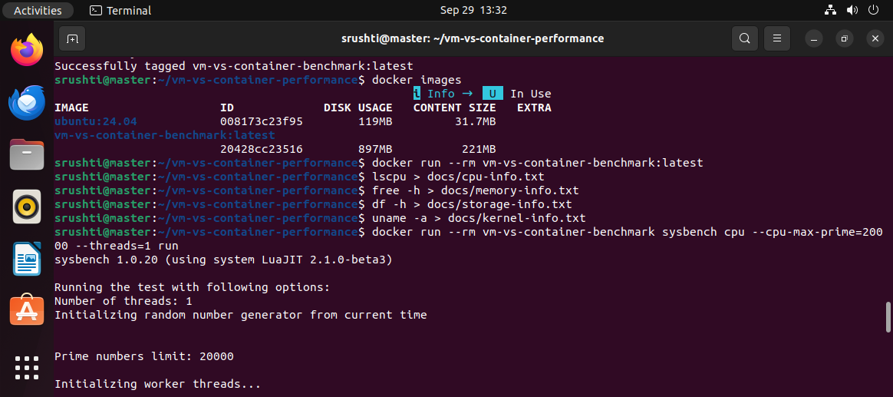

## 2. Baseline System Information

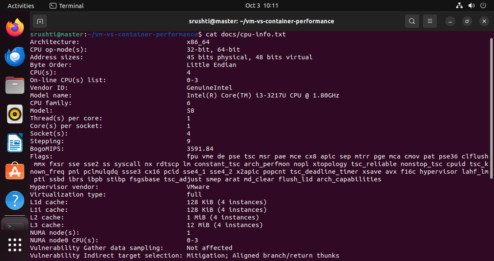

## 3. CPU Benchmark

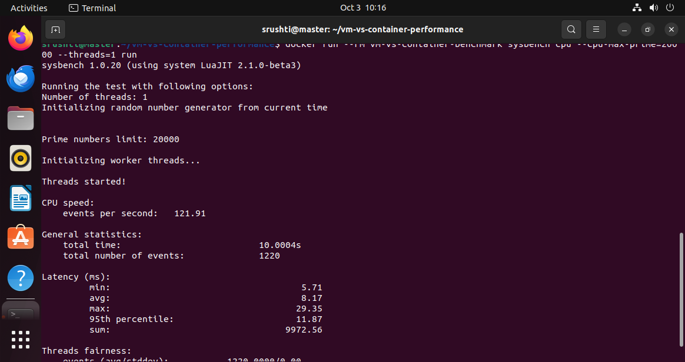

## 4. Memory Benchmark

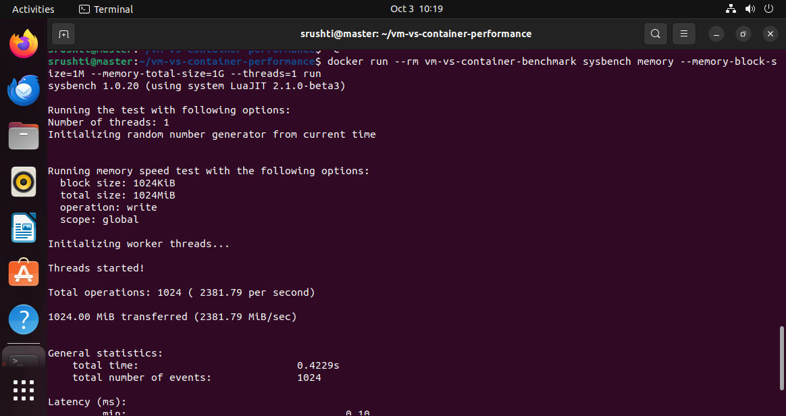

## 5. Disk Benchmark

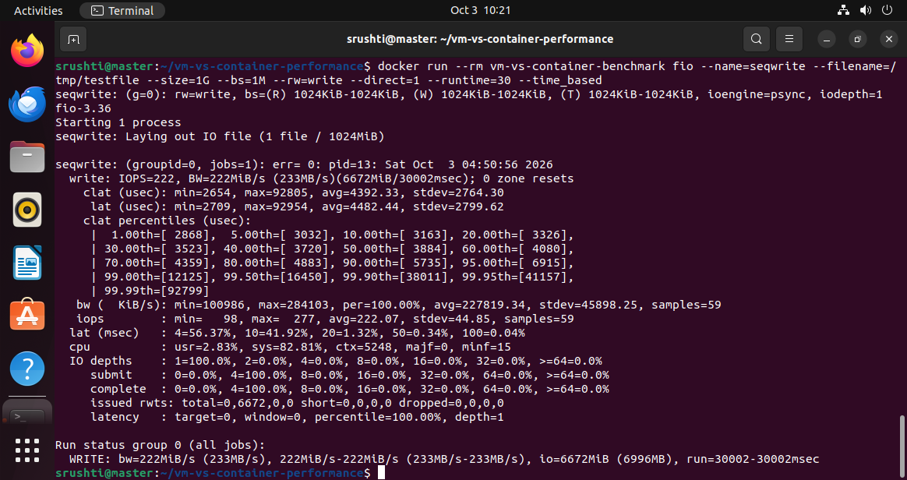

## 6. Network Benchmark

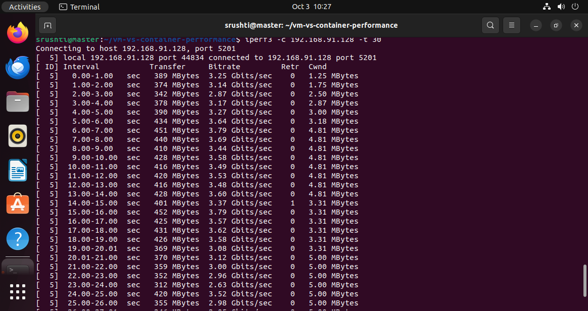

## 7. FastAPI Benchmark

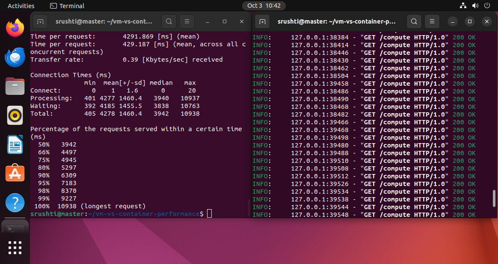

## 8. Startup Test

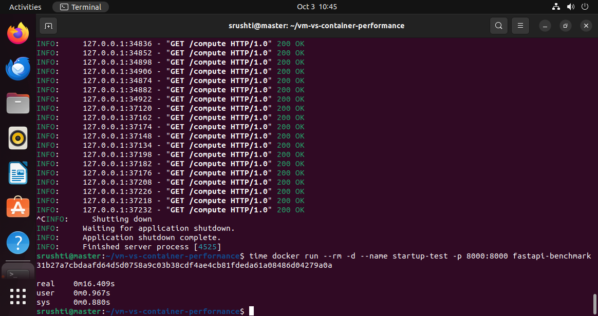

## 9. Scalability Test

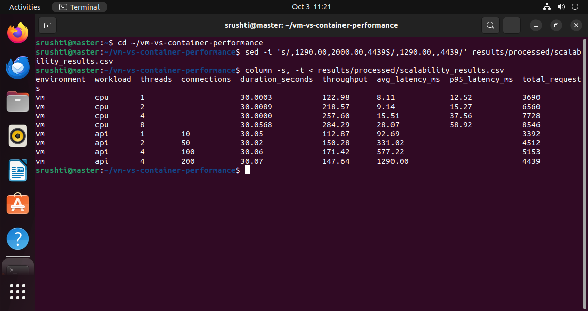

---

# 🐙 GitHub

Git commands should be executed from the project root:

```bash
cd ~/vm-vs-container-performance
```

Check the repository status:

```bash
git status
```

Add changes:

```bash
git add .
```

Commit:

```bash
git commit -m "Update README"
```

Push:

```bash
git push
```

GitHub repository:

**CC2 — Performance Analysis of Virtual Machines and Containers**

---

# 📝 Final Note

This project follows the experimental approach described in the laboratory manual.

The results presented in this README are based on the measurements collected during the experiment. Values that were not measured are not presented as experimental results.

The purpose of the project is to understand the behavior of virtual machines and containers through **actual controlled measurements, statistical analysis, graphs, and reproducible experiments**.

####Author

Name Srushti Shetti

Rollno- 159

USN-01FE24BCI002
